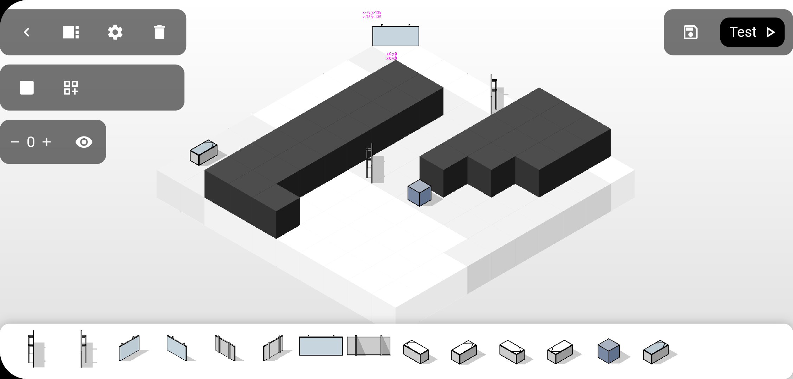
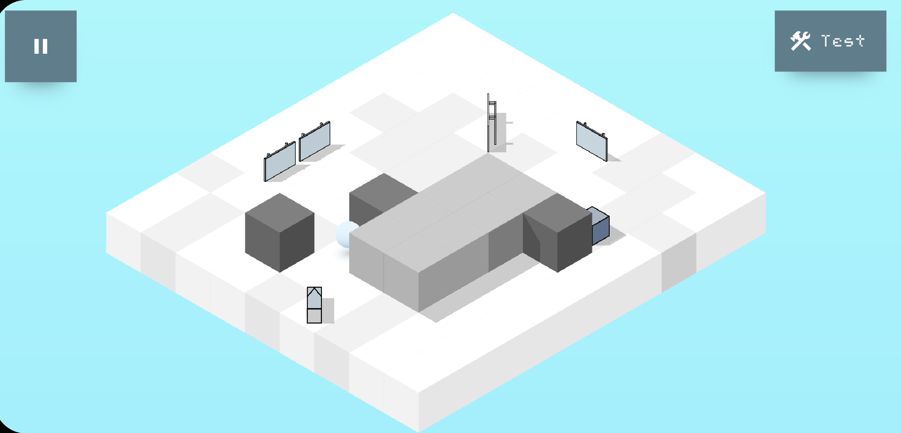
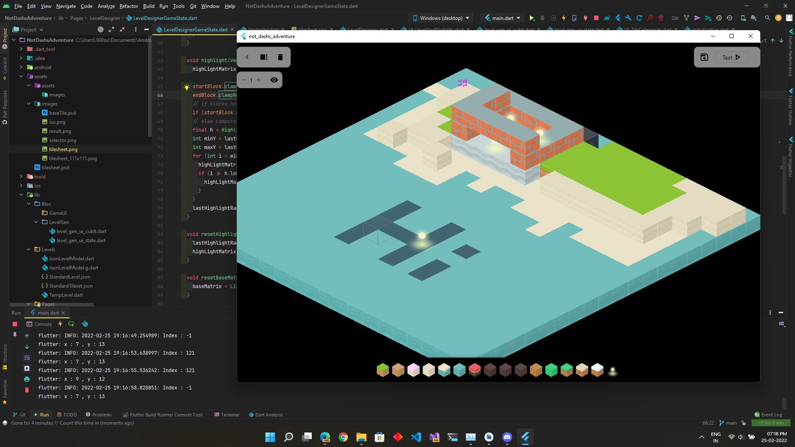

# Iso Worlds / Not dash's (me) Adventure

> This readme is written as bunch of articles/log (whatever this can be called) rather than technical documentation.

## Log 1 : April 6 2022

*Story*

This was a [flutter hack](https://flutterhack.devpost.com/) project which I wasn't able to submit on time *(I was late* (┬┬﹏┬┬) *because I didn't realise daylight savings time was a thing as it didn't apply to me being in IST timezone)*. Either way this was my 2nd major-ish **Flutter** project ever and first time I have interacted with flutter framework to make a game.

**Idea for the game** : IsoWorlds as in name is a isometric 2D world where you have a line source which projects a line into the world which has to reach ending box using series of mirrors which can be moved as tiles in a puzzle. My vision for the game was to make it accessible to community, so people can make their own levels and be able to share it in their own way. ***Ahmm ahmm, obviously too bold of a task to be done a few weeks when I started to build the game towards the end of flutter hack.***

### Screenshots *(were taken on real android device)* : 
Older Editor Version showing level creation

Level Player with no HUD

### Challenges while making the game 🚧

Due to how flutter was made making a isometric real game was not an easy task to be done from scratch (specially at my level of experience with the framework and 3 weeks of offtime development). My inital Guess list of requirements which needed to be built was - 

- Way to cache and import tilesheet/Spritesheet
- Grid calculation for isometric view
- Gesture detection ? (I don't even know how to start to implement this)
- Figure out `Panning` and `Zooming`? Maybe moving and scaling every single sprite that was displayed?
- Maybe a gameloop?
- State management (Bloc and MVVM ain't gonna cut it)
- Layered rendering of Sprites? priorities?
- Level Export and Import format
- Maybe Spritesheets can be imported too with levels?

Yup this was my actual initial List of todos. Fortunately, I was kinda aware about game development space I remembered hearing about [Flame Engine](https://flame-engine.org/). Its an awesome project which not only eliminated many of development headache but it has an awesome community.

As always, with a new architecture of flame engine I was basically a chicken with no head trying to build an isometric game in flutter.

  *Just a screenshot of very early basic design implementation of level editor. As you can tell from date 25.02.22 I was pretty close to deadline with very less work done :P*

>PS : The windows build doesn't work anymore for very random reason which I didn't bother to fix maybe I will soon as I contribute to flame engine as use this as dummy project.

### Basics 

The important blocks to be noticed

| Main Blocks                                    |      Type      |  Direction |
|------------------------------------------------|:--------------:|------------:|
|  |  End Block     | Any         |
|  |  Source Block  | North East  |
|  |  Source Block  | North       |

